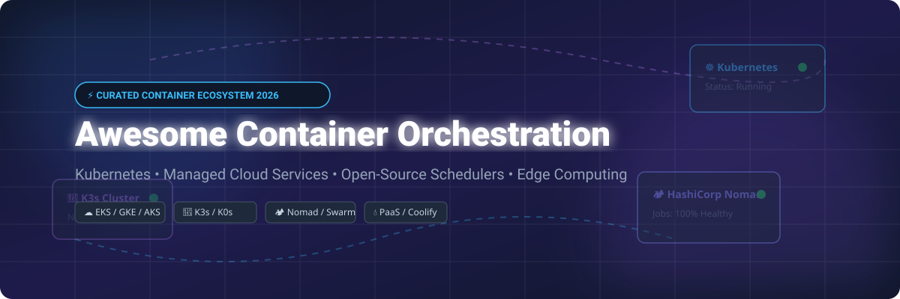

# Awesome-Container-Orchestration-Service

# Awesome-Container-Orchestration-Service ⚓ ☁️

  

  

  

  

  

  

  

---

## 🌟 Top Container Orchestration Service Ecosystem

**Curated List of Commercial Orchestration Platforms & Open-Source Container Schedulers**  

*Focused on Kubernetes-Managed Services, Container Scheduling, Service Mesh Integration, Auto-Scaling, Multi-Cluster Management & Self-Hosted Orchestrators*

**Last updated: October 2026** 📅

---

### 📌 Overview & SEO Summary

Welcome to the ultimate curated directory of **container orchestration platforms**, **open-source container schedulers**, and **managed Kubernetes services**. Whether you are looking for enterprise-grade commercial solutions (such as *Amazon ECS*, *Google Kubernetes Engine*, and *Azure Kubernetes Service*), or self-hostable open-source alternatives (like *Kubernetes*, *Nomad*, and *K3s*), this list covers category leaders, multi-cluster management, and privacy-respecting container orchestration.

**Key Market Context:**

- **Kubernetes has won the orchestration war** — **92% of organizations** use Kubernetes in production, with managed services (EKS, GKE, AKS) dominating.

- **Amazon ECS** remains the **simplest AWS-native orchestrator**, with **no control plane charges** — you pay only for EC2 or Fargate resources .

- **HashiCorp Nomad** is the **simplest non-Kubernetes orchestrator**, supporting **containers, binaries, Java, and VMs** in a single cluster .

- **K3s** is the **lightest Kubernetes distribution**, with **30MB binary** and **<512MB RAM** requirements.

---

## 📑 Table of Contents

- [🏢 SaaS & Commercial Platforms](#-saas--commercial-platforms)

- [🔓 Open-Source GitHub Projects](#-open-source-github-projects)

- [🛠️ How to Contribute](#%EF%B8%8F-how-to-contribute)

- [📊 Star History](#-star-history)

- [🤝 Support & Sponsorship](#-support--sponsorship)

- [⚠️ Disclaimer](#%EF%B8%8F-disclaimer)

---

## 🏢 SaaS / Commercial Platforms

The container orchestration market is dominated by **managed Kubernetes services** (EKS, GKE, AKS) that provide **control plane management with consumption-based pricing**, **cloud-native orchestrators** (ECS, Cloud Run) that offer **simplified container hosting without Kubernetes complexity**, and **enterprise Kubernetes platforms** (OpenShift, Rancher, Tanzu) that provide **multi-cluster management, security, and support**. **Amazon EKS** charges **$0.10/hour per cluster** (~$72/month) plus worker node costs . **Google GKE** charges **$0.10/hour per cluster** for Standard, with **Autopilot at $0.10/hour plus pod resource costs** . **Azure AKS** offers a **free tier** for the control plane, with **Standard at $0.10/hour** and **Premium at $0.60/hour** . **Amazon ECS** has **no control plane charges** — you pay only for EC2 or Fargate resources . **HashiCorp Nomad** uses **custom enterprise pricing** . **Red Hat OpenShift** requires a **Red Hat subscription** .

| SaaS / Commercial Platform | Company / Owner | Valuation / Market Cap | Standard Edition Starting Price | Free Tier / Free Trial Limits | Description |

| :--- | :--- | :--- | :--- | :--- | :--- |

| **[Amazon Elastic Container Service (ECS)](https://aws.amazon.com/ecs/)** ☁️ | Amazon | ~$2.0 Trillion | **No control plane charges**; pay only for EC2 or Fargate  | **Free tier: 750 hours of t2.micro/t3.micro for 12 months**  | **AWS-native container orchestration** — **Simpler than Kubernetes** with **deep AWS integration** . **Two launch types**: **EC2** (you manage instances) and **Fargate** (serverless containers) . **Task definitions** for container configuration. **Service Connect** for service discovery. **No control plane charges** — the simplest AWS orchestration option . |

| **[Google Kubernetes Engine (GKE)](https://cloud.google.com/kubernetes-engine)** 🌐 | Google (Alphabet) | ~$2.0 Trillion | **Standard: $0.10/hour per cluster**; **Autopilot: $0.10/hour + pod resources**  | **$300 free credits** for new customers | **GCP-native Kubernetes** — **The most mature managed Kubernetes** with **Autopilot** for hands-off operations . **GKE Standard**: you manage nodes . **GKE Autopilot**: Google manages nodes, you pay per pod resource . **Release channels** for version management. **Deep integration** with Cloud Run, Cloud Build, and Artifact Registry . |

| **[Azure Kubernetes Service (AKS)](https://azure.microsoft.com/en-us/products/kubernetes-service/)** 🔷 | Microsoft | ~$3.90 Trillion | **Free tier: no control plane charge**; **Standard: $0.10/hour**; **Premium: $0.60/hour**  | **Free tier: no control plane charge**  | **Azure-native Kubernetes** — **Free control plane** in the Free tier . **Standard tier** for production with **99.9% uptime SLA** . **Premium tier** for **99.95% SLA, Long Term Support, and Windows node pools** . **Deep integration** with Azure AD, Monitor, and Policy . |

| **[HashiCorp Nomad](https://www.nomadproject.io/)** 🏕️ | HashiCorp (IBM) | ~$5 Billion (Acquisition) | **Community: Free**; **Enterprise: custom pricing**  | **Community Edition free forever**  | **Simpler non-Kubernetes orchestrator** — **Single binary** that schedules **containers, binaries, Java, and VMs** . **Simpler than Kubernetes** — no control plane, no etcd, no CNI . **Multi-region and multi-cloud** native. **Integrated with Consul and Vault** . **The simplest production-grade orchestrator** . |

| **[Red Hat OpenShift](https://www.redhat.com/en/technologies/cloud-computing/openshift)** 🔴 | Red Hat | ~$50 Billion (IBM) | **Red Hat subscription required**  | **OpenShift Local (CRC) free for development**  | **Enterprise Kubernetes platform** — **Opinionated Kubernetes distribution** with **built-in CI/CD, monitoring, and service mesh** . **OpenShift Dedicated** and **Azure Red Hat OpenShift** as managed services. **The most enterprise-ready Kubernetes platform** . |

| **[Rancher](https://rancher.com/)** 🐄 | SUSE | ~$2.5 Billion | **RKE2: Free**; **Rancher Prime: custom pricing**  | **RKE2 and K3s free forever**  | **Multi-cluster Kubernetes management** — **Manage any Kubernetes cluster** (EKS, GKE, AKS, on-premises) from a single pane of glass . **RKE2** (Rancher Kubernetes Engine 2) for security-focused Kubernetes . **K3s** for edge and IoT . **The most popular open-source multi-cluster management platform** . |

| **[VMware Tanzu](https://tanzu.vmware.com/)** 🏢 | Broadcom (VMware) | ~$60 Billion | **Custom enterprise pricing**  | **Tanzu Community Edition free**  | **Enterprise Kubernetes platform** — **Tanzu Kubernetes Grid** for multi-cloud Kubernetes. **Tanzu Mission Control** for fleet management. **Deep integration with VMware vSphere** . |

| **[Mirantis Kubernetes Engine](https://www.mirantis.com/)** 🔵 | Mirantis | Private | **Custom enterprise pricing**  | **Free trial available**  | **Enterprise Kubernetes** — **Mirantis Kubernetes Engine (MKE)** for on-premises and cloud . **k0s** for lightweight Kubernetes . **The most production-proven enterprise Kubernetes** from the former Docker Enterprise team . |

| **[Cycle.io](https://cycle.io/)** 🔄 | Cycle | Private | **$75/month** (starting)  | **Free tier available**  | **Container orchestration platform** — **Simplified container hosting** without Kubernetes complexity. **Built-in load balancing, service discovery, and secrets management** . |

| **[Portainer Cloud](https://www.portainer.io/)** 🐳 | Portainer | Private | **Free: 5 users, 5 nodes**; **Business: $95/month**  | **Free: 5 users, 5 nodes**  | **Container management platform** — **Web-based UI** for Docker and Kubernetes . **Multi-cluster management** . **RBAC and team management** . **The most popular open-source container console** . |

---

## 🔓 Open-Source GitHub Projects

*Sorted by GitHub_Stars_Count (Descending)* 🌟

- **[Kubernetes](https://github.com/kubernetes/kubernetes)**   

  **Production-grade container orchestration**, Apache-2.0 licensed. **110K+ GitHub stars** — **the de facto standard for container orchestration** . **Automatic scaling, self-healing, service discovery, and load balancing** . **Declarative configuration** with YAML manifests . **The foundation for every managed Kubernetes service** — EKS, GKE, AKS, and OpenShift all run Kubernetes under the hood . **The most important open-source infrastructure project of the last decade** . ☸️

- **[K3s](https://github.com/k3s-io/k3s)**   

  **Lightweight Kubernetes**, Apache-2.0 licensed. **30K+ GitHub stars** — **the lightest certified Kubernetes distribution** . **Single binary under 100MB** — runs on **Raspberry Pi, edge devices, and IoT** . **<512MB RAM** required for the control plane . **Built for resource-constrained environments** . **The standard for edge Kubernetes** . 🍓

- **[Nomad](https://github.com/hashicorp/nomad)**   

  **Easy-to-use, flexible workload orchestrator**, MPL-2.0 licensed. **15K+ GitHub stars** — **the simplest non-Kubernetes orchestrator** . **Single binary** that schedules **containers, binaries, Java, and VMs** — **no control plane, no etcd, no CNI** . **Multi-region and multi-cloud** native. **Integrated with Consul and Vault** . **The simplest production-grade orchestrator** — deploy in minutes, scale to thousands of nodes . 🏕️

- **[RKE2](https://github.com/rancher/rke2)**   

  **Rancher Kubernetes Engine 2**, Apache-2.0 licensed. **Security-focused Kubernetes distribution** — **FIPS 140-2 compliant** . **No etcd exposure** — runs etcd as a static pod . **CIS benchmark hardened** . **The most secure open-source Kubernetes distribution** . 🔐

- **[K0s](https://github.com/k0sproject/k0s)**   

  **Zero-friction Kubernetes**, Apache-2.0 licensed. **Single binary with zero dependencies** — no container runtime required . **The simplest Kubernetes to install** — `k0s install controller` and you're running . **From Mirantis** — the former Docker Enterprise team . **The most accessible Kubernetes distribution** . ⚡

- **[Talos Linux](https://github.com/siderolabs/talos)**   

  **Kubernetes OS with immutable infrastructure**, MPL-2.0 licensed. **API-driven, immutable, and minimal** — **no SSH, no shell, no package manager** . **The most secure Kubernetes OS** . **Used by Equinix Metal and other cloud providers** . 🛡️

- **[MicroK8s](https://github.com/canonical/microk8s)**   

  **Lightweight Kubernetes for developers and edge**, Apache-2.0 licensed. **Single snap package** — **install in seconds** . **Add-ons for Istio, Knative, and Kubeflow** . **The simplest Kubernetes for local development** . 📦

- **[K9s](https://github.com/derailed/k9s)**   

  **Kubernetes CLI to manage your clusters in style**, Apache-2.0 licensed. **25K+ GitHub stars** — **the standard Kubernetes terminal UI** . **Real-time cluster monitoring** . **Resource management, logs, and shell** . **The most popular Kubernetes CLI tool** . 🐕

- **[Lens](https://github.com/lensapp/lens)**   

  **The Kubernetes IDE**, MIT licensed. **22K+ GitHub stars** — **the most popular Kubernetes GUI** . **Multi-cluster management** . **Real-time metrics and logs** . **The standard Kubernetes desktop experience** . 🔭

- **[Argo CD](https://github.com/argoproj/argo-cd)**   

  **Declarative GitOps continuous delivery for Kubernetes**, Apache-2.0 licensed. **12K+ GitHub stars** — **the standard GitOps tool for Kubernetes** . **Watches Git repositories and syncs application state** . **The definitive Kubernetes deployment automation** . 🎯

---

## 🛠️ How to Contribute

Contributions are welcome! Follow these steps to submit new container orchestration platforms or open-source orchestrator software:

1. 🍴 **Fork** the repository.

2. 📝 **Add/edit** entries in `README.md` maintaining table/list structure and formatting.

3. 🔗 Include project title, official website/GitHub link, exact Stars_Count, license, and brief description.

4. 🚀 Submit a **Pull Request** with a descriptive summary of your changes.

---

## 📊 Star History

---

## 🤝 Support & Sponsorship

If you find this container orchestration repository useful, please consider supporting the project:

- ⭐ **Star** this repository to increase visibility!

- 🔀 **Fork** and share with fellow DevOps engineers, platform teams, and open-source advocates.

- ☕ **Sponsor & Buy Me a Coffee**: Support ongoing open-source curation via the [GitHub Sponsor Dashboard](https://github.com/sponsors/ishandutta2007).

---

## ⚠️ Disclaimer

- This is a **community-curated** list — not exhaustive and not an endorsement. ℹ️

- **Kubernetes has won the orchestration war** — **92% of organizations** use it in production . **Managed services (EKS, GKE, AKS)** dominate because they abstract control plane management.

- **Amazon ECS has no control plane charges** — you pay only for EC2 or Fargate resources . **EKS charges $0.10/hour per cluster** (~$72/month) plus worker nodes . **Azure AKS offers a free control plane tier** .

- **Nomad is the simplest non-Kubernetes orchestrator** — **single binary, no control plane, no etcd, no CNI** . **K3s is the lightest Kubernetes** — **30MB binary, <512MB RAM** for edge devices .

- **Open-source orchestrators (Kubernetes, K3s, Nomad, RKE2) are not turnkey** — they require **deployment, configuration, and ongoing maintenance** . **Always validate performance and security with a proof-of-concept** before production deployment . ⚓

---

  <b>Made with ❤️ for DevOps engineers, platform teams, and open-source container orchestration advocates.</b>

